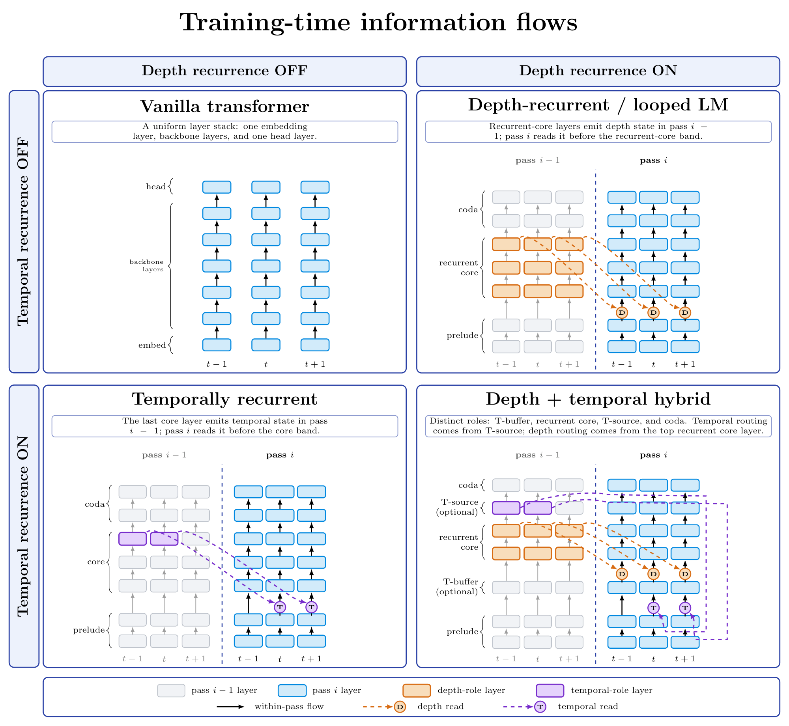
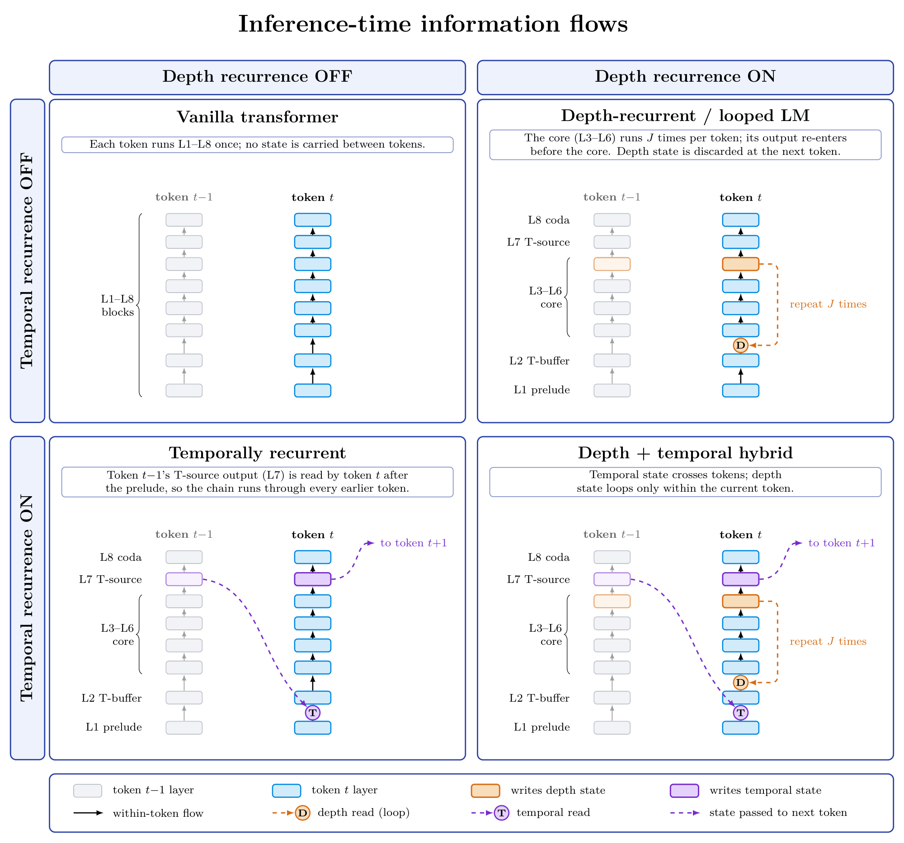
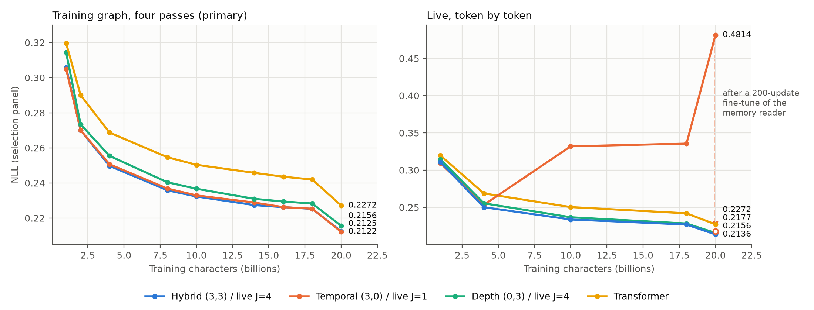

# 2D recurrence: training looped and feedback transformers at once

**Looped transformers and temporally recurrent (feedback) transformers are both trained the same way: run the model several times over the whole sequence, and let each pass read state left behind by the previous one. If the training loop is the same, you can train both mechanisms in one model, in one trajectory, for little extra cost.**

This repository tests that idea on a small character-level chess language model: the [ChessGPT](https://github.com/adamkarvonen/train_ChessGPT) backbone, with 8 layers and width 512, trained on PGN text.



## The idea in four pictures

Read the figure as a 2×2 grid. The columns switch **depth recurrence** off and on. The rows switch **temporal recurrence** off and on. The model has eight layers, L1–L8. In the recurrent panels, each position shows two consecutive training passes side by side: pass *i−1* in grey, pass *i* in blue. Layers a pass doesn't run are dashed, and the prelude is one shared box because it runs once.

- **Top left, vanilla transformer.** One pass, bottom to top. Position *t* sees earlier positions only through attention.
- **Top right, looped (depth-recurrent) model.** A shared *recurrent core* runs several times. On pass *i*, the core output (L6) from pass *i−1* at the **same position** is mixed in before the core (short orange arrows, **D**). This is the [Huginn](https://arxiv.org/abs/2502.05171)-style looped transformer: more computation per token, no new core parameters.
- **Bottom left, temporally recurrent model.** The T-source output (L7) from pass *i−1* at the **previous position** *t−1* is mixed in right after the prelude on pass *i* (long purple arrows, **T**). A high-level state flows forward in time, as in feedback transformers.
- **Bottom right, hybrid.** Both reads at once. Depth state comes from the top of the recurrent core (L6), and temporal state from the *T-source* layer above it (L7). Temporal state is injected below the *T-buffer* layer (L2), depth state above it.

The two recurrent models differ in only two ways: **where** the state is read, and whether it is **shifted by one position**. Both are trained by unrolling passes over the whole sequence in parallel, so one training loop serves both.

In this repository, the temporal-only and depth-only models are restrictions of the hybrid. They keep the same eight-layer layout, including the T-source layer.

## One sampler trains both

For every microbatch, training draws a pair of update counts `(U_T, U_D)`, for example `(3, 1)`. It then runs `max(U_T, U_D) + 1` passes and writes each state after a random subset of the non-final passes:

```text
pass:              1   2   3   4
temporal write:    ✓   ✓   ✓   –
depth write:       –   ✓   –   –
```

Every pass reads whatever state exists; a state that isn't rewritten is simply held. Only the final pass is supervised, and gradients flow through the whole trajectory. The model is never told how many passes it will get.

So `(0,0)` is an ordinary transformer, `(U,0)` trains the temporal axis, `(0,U)` trains the depth axis, and mixed pairs train the two together. A single checkpoint can be evaluated anywhere on the `(U_T, U_D)` surface.

**How cheap is it?** If you already train one of the two mechanisms this way, adding the other is close to free.

| Training compute per update | vs transformer |
| --- | --- |
| Depth-only | 2.45× |
| Temporal-only | 2.80× |
| **Hybrid** | **2.81×** |

- **Adding depth to a temporal model costs 0.2%.**
- **Adding temporal to a depth model costs about 15%.**

These are estimated FLOPs: the matrix multiplications of the forward pass, including attention and both mixers, averaged over the 20B curriculum ([`training_flops.py`](experiments/long_runs/20B_recurrence/training_flops.py)). Backward work scales with them, so the ratios hold for training.

The reason is that both recurrent models pay for the same extra passes over the recurrent core:
- **Depth recurrence** adds only a small mixer to each pass.
- **Temporal recurrence** also reruns the T-source layer for every memory write, and its mixer is larger.

Whether the second connection also improves the model is a separate question; the results below address it.

At inference, one core iteration per token costs about 12–13% more than the plain transformer; four iterations cost about 2.5×.

## At inference, the two axes separate again



Parallel multi-pass training is only a way to *train* recurrence. When generating, the model runs token by token:

- **Depth** loops the recurrent core `J` times *within* the current token. The depth state is discarded at the next token.
- **Temporal** state is written once per token by the T-source and read by the *next* token, across the whole sequence.

During training, `U` passes chain the temporal state only `U` positions back. At inference the chain runs through every earlier token. The two executions need not agree, so the repository measures both. At 20B, the hybrid and depth models ran live at their training-graph quality. The temporal-only model did not until it was also trained on the memory that live execution produces; see the [20B report](experiments/long_runs/20B_recurrence/REPORT.md#why-temporal-fails-live).

## Results

Four separately trained models, each on 20B characters: transformer, temporal-only, depth-only and hybrid. Details are in the [20B report](experiments/long_runs/20B_recurrence/REPORT.md).



- **All three recurrent models beat the transformer** by 0.012–0.014 NLL at four passes, with the same data.
- **The hybrid ties temporal-only and beats depth-only.** Hybrid and temporal both reach 0.2136 on held-out rows; depth trails by 0.0024. The gaps did not grow with scale, from 4B to 20B.
- **The gains are in choosing the move, and they grow over the game.** The hybrid's advantage over the transformer rises from 0.001 NLL in the first ten plies to 0.028 later in the game.
- **Deployed token by token,** the hybrid with four core iterations is the best model (0.2137 NLL), slightly ahead of depth-only at the same cost. With 3× less data, it also edges out Karvonen's released 8-layer model on the same rows.

These are single-seed results.

## Open questions

- **Seeds:** do the results hold across training seeds?
- **Update support:** does training on every update count up to the maximum, with no gaps, prevent the live mismatch without a fix? See the [follow-ups](experiments/ablations/live_warm_start/PLAN.md).
- **More passes:** do models trained beyond four passes keep gaining?

## Quick start

```sh
uv sync --frozen --python 3.11
uv run pytest -q
uv run python data/chess_v1/prepare.py --file lichess_100mb_blocks.zip --out-dir data/chess_143K_v1
uv run python train.py configs/local/recurrent_mps.py
```

This runs a small local check on Apple MPS. The [usage guide](docs/usage.md) covers the full-corpus setup, resume rules, evaluation and generation.

## Where to go next

| If you want to… | Read |
| --- | --- |
| Understand the model step by step | [Concepts](docs/concepts.md) |
| See the exact training equations, initialization and masking | [Recurrence contract](docs/RECURRENCE_CONTRACT.md) |
| Understand token-by-token generation and KV caches | [Inference contract](docs/INFERENCE_CONTRACT.md) |
| Train, resume, evaluate or generate | [Usage guide](docs/usage.md) |
| Find experiments, protocols and results | [Experiment index](experiments/README.md) |
| Read the 20B results | [20B report](experiments/long_runs/20B_recurrence/REPORT.md) |
| Evaluate checkpoints the same way | [Evaluation battery](experiments/evaluation_battery/README.md) |

## Background

- Looped / recurrent-depth transformers: [Huginn](https://arxiv.org/abs/2502.05171) ([code](https://github.com/seal-rg/recurrent-pretraining)), [Ouro](https://arxiv.org/abs/2510.25741)
- Temporal feedback: [Full-Bandwidth Transformer](https://arxiv.org/abs/2608.08888), [multipass-transformer-training](https://github.com/PeterBjerreHansen/multipass-transformer-training), [multipass-transformer-memory](https://github.com/PeterBjerreHansen/multipass-transformer-memory)
- Chess language modeling: [train_ChessGPT](https://github.com/adamkarvonen/train_ChessGPT), [chess world models](https://adamkarvonen.github.io/machine_learning/2024/01/03/chess-world-models.html)
