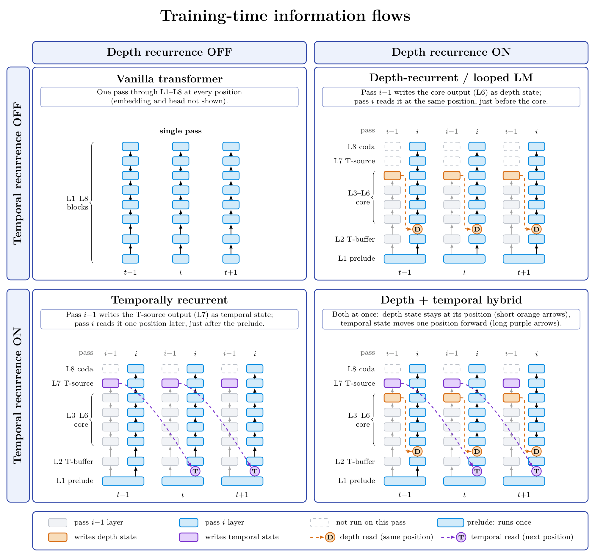
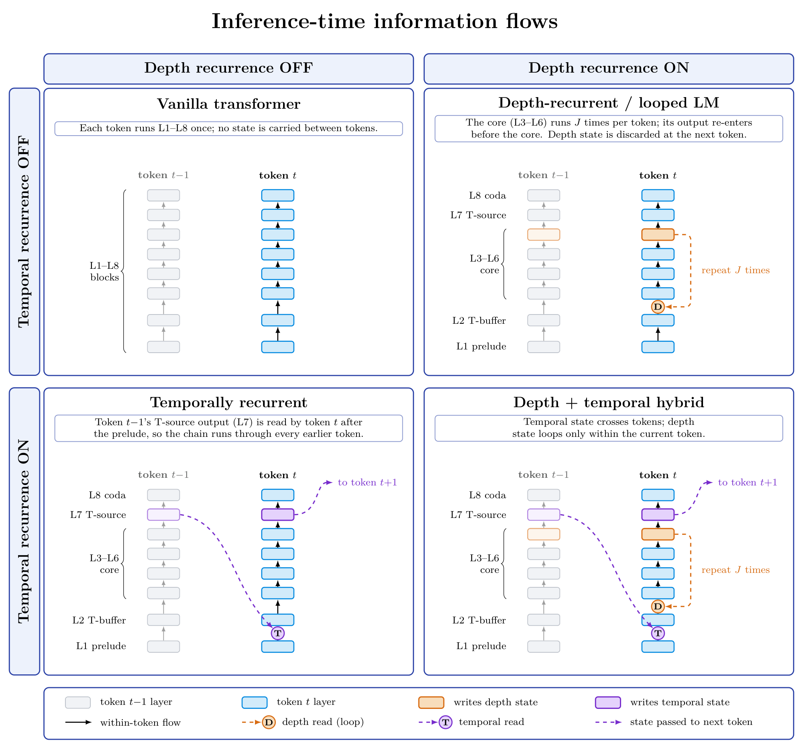
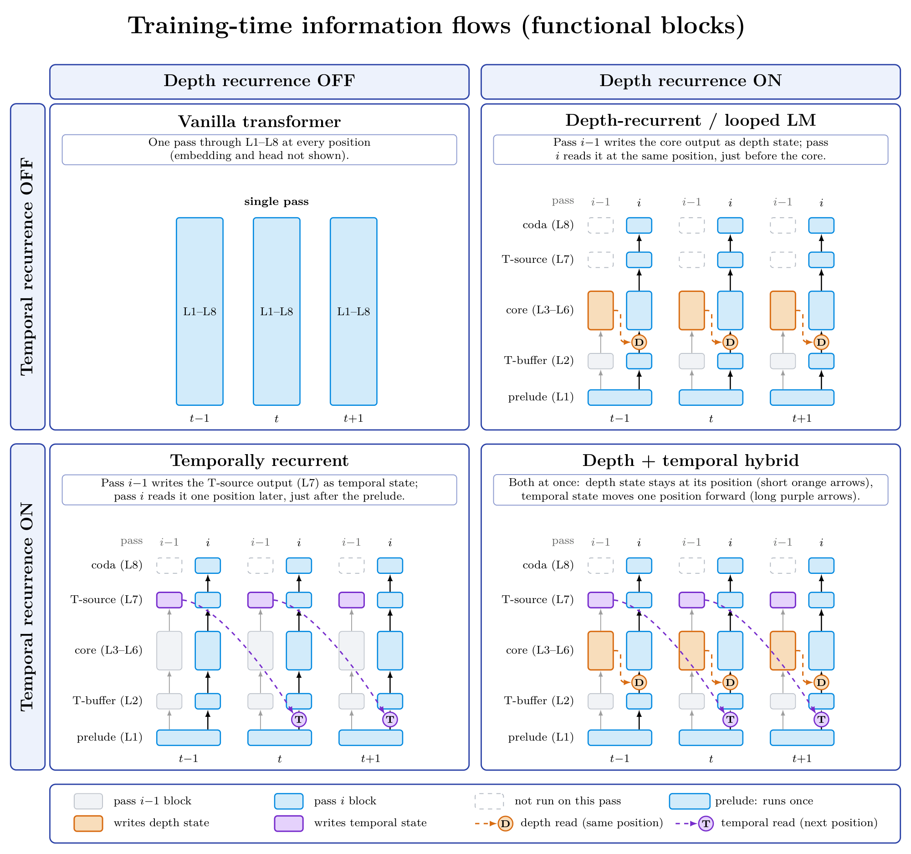
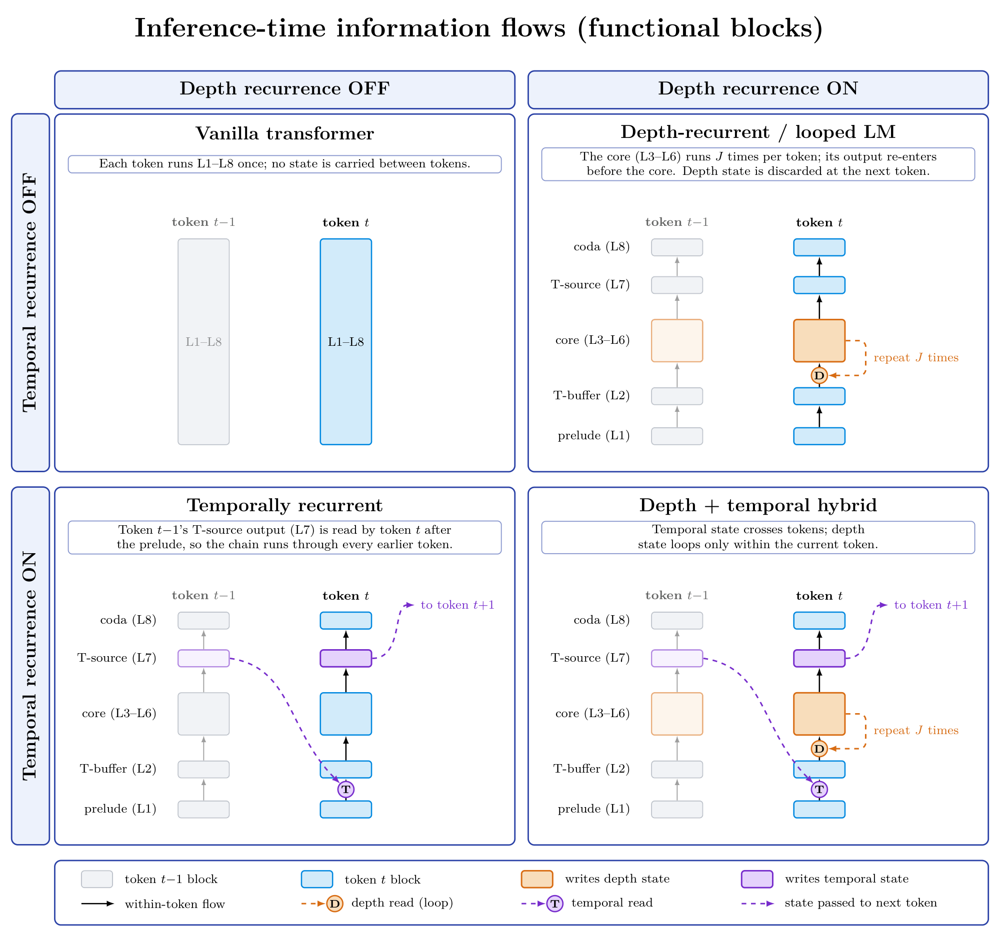

# Concepts: from one pass to two axes of recurrence

This page builds the model one idea at a time: a plain transformer, a looped one, a temporally recurrent one, and finally the hybrid trained in this repository. Exact equations and edge cases are in the [recurrence contract](RECURRENCE_CONTRACT.md); this page aims for intuition.

The figures are a 2×2 grid. Columns switch depth recurrence off and on; rows switch temporal recurrence off and on. There are two views of each model:

- **Layer-wise:** every transformer layer drawn, with its role.
- **Functional:** layers grouped into blocks by role.

In the training figures, each position shows two consecutive passes side by side: pass *i−1* in grey and pass *i* in blue. A depth read is a short arrow within a position; a temporal read is a long arrow to the next position. Layers a pass doesn't run are dashed.





## 1. A plain transformer

One pass, bottom to top (top-left panel). Position *t* sees earlier positions only through attention to same-layer states. Nothing computed high up at position *t−1* feeds back into the low layers of position *t*, and every token gets the same fixed amount of computation.

Every later model keeps three roles from this stack:

- the **prelude**: early layers that run once;
- a **body** in the middle;
- the **coda**: late layers leading to the prediction head.

## 2. Loop the middle: depth recurrence

A looped model shares one block of layers, the **recurrent core**, and runs it several times (top-right panel). Before each pass after the first, the core's previous output is mixed back into its input:

```text
z = W_h · norm(h_prev) + W_a · norm(anchor)        # both start at 0.5 · I
```

The **anchor** is the fixed early representation of the current token. Mixing it back in on every pass keeps the loop grounded in the input.

- **Training:** unroll the passes over the whole sequence and backpropagate through all of them.
- **Inference:** loop the core `J` times inside each token. Depth state starts fresh at every token.

This is the idea behind [Huginn](https://arxiv.org/abs/2502.05171) and [Ouro](https://arxiv.org/abs/2510.25741): more computation per token without more core parameters.

## 3. Feed the top back to the bottom: temporal recurrence

A temporally recurrent model takes a late representation of token *t−1* and mixes it into the early layers of token *t* (bottom-left panel). A high-level state is carried forward in time instead of being recomputed from scratch.

Run strictly token by token, this is sequential and cannot be parallelized over a training sequence. The workaround is **multi-pass (Jacobi-style) training**:

1. Run the whole sequence once.
2. On the next pass, each position reads its *predecessor's* late state from the *previous pass*, shifted right by one position.
3. Repeat. `U` passes let the state travel `U` positions through the feedback path.

The memory enters through a gated mixer:

```text
(α, β) = sigmoid(G([norm(r); norm(p)]))
a = α ⊙ W_m · norm(r) + β ⊙ W_p · norm(p)          # α starts at 0.1, β at 0.9
```

Position 0 has no predecessor, so it bypasses the mixer. A zero-valued memory anywhere else is still a valid input.

At inference, the state is written once per token and read by the next one. The chain now runs through *every* earlier token, while training only chained a few. The two executions are therefore different, and their difference is something to measure (see §7).

In this repository, the temporal-only model keeps the full layout: its memory comes from the T-source (L7), as in the hybrid.

## 4. Steps 2 and 3 train the same way

Put the two training panels side by side. Both do the same thing: run the stack again, and let each pass read a state from the previous pass. They differ in two details:

| | Reads a state from… | Injected… |
| --- | --- | --- |
| Depth | the same position | just before the recurrent core |
| Temporal | the previous position (shifted by one) | right after the prelude |

The machinery is otherwise identical: the same unrolled passes, the same full backpropagation, the same cost structure. Nothing stops one trajectory from carrying **both** states. That is the central claim this repository tests.

## 5. The hybrid

The bottom-right panel combines both. The default layout **A** assigns the eight layers these roles:

```text
L1     prelude      runs once per trajectory
       ── temporal mix: shifted memory from L7 ──
L2     T-buffer     runs every pass
       ── depth mix: held state from L6 ──
L3–L6  recurrent core
L7     T-source     its output is the temporal memory
L8     coda         final pass only, then the head
```

- Depth state comes from the core output (L6).
- Temporal state comes from the T-source (L7).
- The two are injected at different heights, with the T-buffer between them.

A near-tied [A/B comparison](../experiments/ablations/architecture_sites/REPORT.md) chose this layout over one where both states share a site. It is a practical default, not a proven winner. The block counts are configurable; see the [usage guide](usage.md#configurable-layout).

The functional view shows the same four models with layers grouped into blocks:





## 6. One sampler trains the whole family

The figures show one pass handing state to the next. In training, *which* passes write which state is random. For each microbatch:

1. Draw update counts `(U_T, U_D)` from a configured distribution, for example over `{0, 1, 3}²`.
2. Run `B = max(U_T, U_D) + 1` passes.
3. Choose `U_T` of the `B − 1` non-final passes to write temporal state, and `U_D` to write depth state, uniformly at random.

Masks control **writes only**. Every pass reads every state that exists; a state that isn't rewritten is held, with its gradient connection intact. For `(U_T, U_D) = (2, 4)`, two possible schedules are:

```text
pass:                1   2   3   4   5
temporal write, A:   ✓   –   ✓   –   (final pass: no writes)
temporal write, B:   –   ✓   –   ✓
depth write:         ✓   ✓   ✓   ✓
```

Under A, passes 2–3 read the memory written after pass 1, and passes 4–5 read the memory written after pass 3. Under B, temporal feedback is absent on passes 1–2.

The limiting cases are exact:

| Update counts | What runs |
| --- | --- |
| `(0, 0)` | the ordinary transformer, one pass |
| `(U, 0)` | temporal recurrence only |
| `(0, U)` | depth recurrence only |
| both nonzero | the hybrid |

The model never receives the counts, pass index or state ages as inputs. So one training run produces one model that can be evaluated at any `(U_T, U_D)`. Separately trained temporal-only and depth-only models are the same code restricted to one axis (`recurrence_mode`).

## 7. Two ways to run a trained model

| | Training graph | Live execution |
| --- | --- | --- |
| How it runs | all positions in parallel, a fixed write schedule | token by token with KV caches |
| Temporal state | chained `U` positions back | chained through every earlier token |
| Depth state | per pass, over the whole sequence | per token, `J` core iterations |
| Used for | the evaluation grid; training-graph generation | live NLL; live generation |

For depth-only models the two executions agree exactly when each depth keeps its own KV cache. For temporal and hybrid models they differ, and the difference is a result, not a bug. The [inference contract](INFERENCE_CONTRACT.md) gives the details.

## 8. What it costs

Counting transformer-block applications for layout A:

- **Training pass count `B`:** `3 + 5B + U_T`. The prelude and coda run once; the buffer and core run every pass; the T-source runs once per temporal write plus once for the prediction.
- **Live inference with `J` core iterations per token:** `4 + 4J`.

Measured in the 5B-character study, with the same distribution of pass counts, a hybrid update took about 1.00 s, a temporal-only update 1.03 s, and a depth-only update 0.90 s. Each arm ran on its own RTX 3090 pod. Adding the second axis to a model that already loops costs little. Most of the cost is the passes themselves.

Always say what a comparison holds equal: data, passes, FLOPs or parameters. They answer different questions.

## Glossary

| Term | Meaning |
| --- | --- |
| `U_T`, `U_D` | Exact numbers of temporal and depth state writes in one trajectory |
| pass | One run of buffer + core (+ T-source when needed); `B = max(U_T, U_D) + 1` |
| write mask | Which non-final passes write a state; masks never control reads |
| held state | A state kept unchanged (with its gradients) across passes that don't write it |
| anchor | The current token's early representation that each pass mixes with the recurrent state |
| T-buffer | Layers between the temporal and depth injection sites |
| T-source | Layers between the core and coda whose output becomes the temporal memory |
| training graph | Parallel multi-pass execution with an explicit write schedule |
| live execution | Token-by-token execution with real temporal feedback |
| update support / probabilities / schedule | Allowed counts, their joint distribution, and its optional change over training steps (see [CONTEXT.md](../CONTEXT.md)) |
