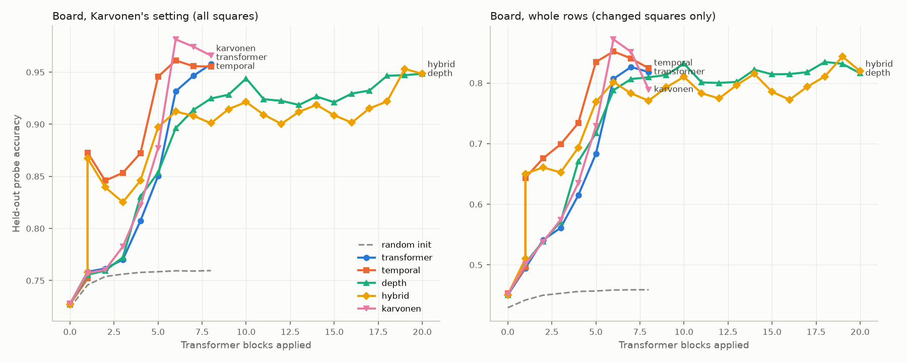

# Board-state probing: report

Linear probes for the board and the side to move at every residual-stream site of the four 20B arms, Karvonen's released 8-layer model and a random-init control, with causal checks. Setup and commands are in the [README](README.md).

## Summary

- **The pipeline reproduces Karvonen.** In his setting, his model's board probe peaks at L6 with 0.981 of squares correct (paper: 0.991, with about ten times more probe games). The random-init model scores 0.760 (paper: 0.750). His 99% holds only for each game's first 365 characters; over whole rows the best probe reads 0.90–0.93.
- **The temporal memory brings the board in early.** Right after the temporal mixer (`Tmix`, one block applied), temporal and hybrid decode the board at 0.87. The transformer reaches 0.85 only at L5.
- **The memory holds almost the whole board, but the mixer drops part of it.** The memory a dot reads decodes at 0.939 (temporal) and 0.959 (hybrid); after the mixer, 0.873 and 0.867. Mostly older changes are lost. The memory's term entering the mixer is smaller than the current character's (median 0.64×, hybrid 0.50×).
- **The model uses the board in its memory to choose its move.** Swapping the memories read by the last 64 characters for another game's moves the board at L6 and the next move toward that other game.
- **The full board is assembled where a move is chosen.** At the decision characters and the move's first character, older changes read at 0.86–0.89 by L5. The board then fades as the move is written (0.79 inside it, 0.76 at its last character). At spaces before move numbers and at digits it stays at 0.67–0.75.
- **Recurrence gives an earlier board, not a much better one.** Best board, Karvonen setting: temporal 0.961, transformer 0.958, hybrid 0.953, depth 0.948, Karvonen's 3×-longer-trained transformer 0.981. On changed squares over whole rows temporal leads our transformer by 0.026.
- **Looped cores add little after their first or second pass.** Depth needs its second iteration for the board and the move; the hybrid has both after its first. Its iterations restart mostly from L2: the previous iteration enters at half the weight of the fresh start (depth model: 0.8).
- **The probes are causal where the model reads them.**
  - Pushing the side-to-move direction at L2–L3 flips the model between predicting a move number and a move in 96–100% of held-out cases in the transformer and depth arms.
  - Deleting a piece from the probed board in the late layers makes the new move legal on the modified board 64–72% of the time across our arms, against 10–19% for random directions.
- **One training seed per arm, one probe split.** Probe differences of about 0.005 should not be read as real.

*Held-out probe accuracy at every site. Looped arms show every core iteration, so the x-axis is compute. `Tmix` is drawn at the same x as L1. Figure: `figures.py`.*

## Replicating Karvonen

Karvonen's probe code (`chess_llm_interpretability`) truncates each probe game to its first 365 characters and probes only `.` characters within them. Probing whole rows, which contain long games and later games in a row, gives lower accuracy. `board_karvonen` applies his restriction.

| Model | L4 | L5 | L6 | L7 | L8 |
| --- | --- | --- | --- | --- | --- |
| Karvonen's model | 0.822 | 0.877 | **0.981** | 0.974 | 0.966 |
| Our transformer | 0.807 | 0.850 | 0.932 | 0.946 | **0.958** |
| Random init | 0.758 | 0.758 | 0.759 | 0.759 | 0.760 |

The per-square majority baseline is 0.667. At `.` characters White is always to move, so the mine/theirs encoding coincides with white/black there.

## Layer curves

Board accuracy in Karvonen's setting, and on changed squares (class differs from the starting position) over whole rows:

| Arm | Early site | Karvonen setting at early site | Best, Karvonen setting (site) | Best, changed squares (site) |
| --- | --- | --- | --- | --- |
| Transformer | L2 | 0.762 | 0.958 (L8) | 0.826 (L7) |
| Temporal | `Tmix` | **0.873** | **0.961 (L6)** | **0.852 (L6)** |
| Depth | L2 | 0.760 | 0.948 (L8) | 0.835 (L6@4) |
| Hybrid | `Tmix` | **0.867** | 0.953 (L7) | 0.844 (L7) |
| Karvonen | L2 | 0.760 | 0.981 (L6) | 0.872 (L6) |

- **The early jump is the temporal read.** Temporal gains 0.12 and the hybrid 0.11 between L1 and `Tmix`, with no block applied in between.
- **Looped cores:**
  - Depth: 0.896 after its first iteration (L6@1), 0.944 after its second, 0.947 after its fourth.
  - Hybrid: 0.912 after its first iteration, 0.922 after its fourth, then 0.953 at L7.
- **Side to move** is decoded perfectly from L2 in every trained arm (random init: 0.54). The two space kinds are the same input token, so this is computed rather than read off the input.

## The board across the move cycle

`cycle.py` labels every character with its role and with the board after the latest applied move. A move counts as applied at its last character, where the model must know the new position to predict `+`. Each cell is probe accuracy on **squares the latest move changed / squares changed earlier**. Never-changed squares read 0.89–0.97 everywhere. Black's move characters match White's to within 0.01; the check-marker rows are omitted (600 test characters each).

| Temporal: character (e.g. `…Nc6 12.Bb5 a6`) | Memory it reads | `Tmix` | L2 | L5 | L7 |
| --- | --- | --- | --- | --- | --- |
| Space after Black's move | 0.95 / 0.77 | 0.92 / 0.61 | 0.85 / 0.66 | 0.80 / 0.67 | 0.77 / 0.67 |
| Move-number digit | 0.62 / 0.65 | 0.45 / 0.55 | 0.52 / 0.59 | 0.66 / 0.73 | 0.68 / 0.75 |
| `.` (White decides) | 0.86 / 0.86 | 0.59 / 0.70 | 0.69 / 0.70 | 0.87 / 0.89 | 0.86 / 0.90 |
| First character of White's move | 0.86 / 0.90 | 0.64 / 0.76 | 0.68 / 0.74 | 0.81 / 0.86 | 0.80 / 0.84 |
| Inside White's move | 0.79 / 0.82 | 0.56 / 0.65 | 0.61 / 0.66 | 0.74 / 0.79 | 0.73 / 0.77 |
| Last character of White's move | 0.81 / 0.77 | 0.85 / 0.61 | 0.84 / 0.64 | 0.98 / 0.76 | 0.97 / 0.77 |
| Space after White's move (Black decides) | 0.95 / 0.76 | 0.91 / 0.60 | 0.82 / 0.67 | 0.87 / 0.89 | 0.86 / 0.90 |

| Transformer | Previous character's L7 | L2 | L5 | L7 |
| --- | --- | --- | --- | --- |
| `.` | 0.53 / 0.69 | 0.46 / 0.55 | 0.83 / 0.70 | 0.85 / 0.88 |
| First character of White's move | 0.85 / 0.88 | 0.46 / 0.55 | 0.65 / 0.69 | 0.79 / 0.85 |
| Last character of White's move | 0.82 / 0.79 | 0.56 / 0.55 | 0.98 / 0.63 | 0.98 / 0.79 |
| Space after White's move | 0.96 / 0.79 | 0.49 / 0.55 | 0.85 / 0.70 | 0.85 / 0.88 |

- **The move is applied at its last character, by L5:** 0.98 on the moved squares in both models.
- **The full board is assembled at the decision characters.** It carries into the move's first character (0.86 on older changes at L5) and fades as the move is written (0.79 inside it, 0.76 at its last character). At spaces before move numbers and at digits, older changes stay at 0.67–0.75 even in late layers.
- **At every role the mixer passes less than the memory holds,** most for older changes and after bookkeeping characters. Right after a move, the latest move survives it (0.95 → 0.92).
- **The mixer's gates barely vary by role:** memory gate means 0.11–0.20, slightly higher inside moves.
- **The transformer has the same rhythm without the early start:** at L2 it reads 0.44–0.57 / 0.55–0.63 across roles, against 0.52–0.85 / 0.59–0.74 for temporal.

## The mixer

`mixer.py`. At dots in Karvonen's setting, board probes on the memory the dot reads (L7 of the previous character), on the mixer output and on L2:

| | Memory | `Tmix` | L2 |
| --- | --- | --- | --- |
| Temporal, all squares / changed | 0.939 / 0.893 | 0.873 / 0.759 | 0.846 / 0.722 |
| Hybrid, all squares / changed | 0.959 / 0.926 | 0.867 / 0.754 | 0.839 / 0.708 |

Contributions entering the mixer, over all positions of 40 rows:

- **Temporal:** the memory term (gate × projected memory) is a median 0.64× the current-character term, 10th–90th percentile 0.32–0.98. The hybrid's is 0.50× (0.25–0.74).
- **Gates:** mean gates are 0.16 (memory) and 0.12 (current character) for temporal, 0.08 and 0.15 for the hybrid. They start at 0.10 and 0.90.
- **Depth mixer, entering each iteration:** the previous iteration's term is 0.48–0.50× the fresh start from L2 in the hybrid, and 0.79–0.85× in the depth model.

## The memory carries the board

**Memory swap** (`swap.py`, 200 pairs of white-to-move dots at the same ply from different held-out games). For the last *k* characters of game A, the memory each character reads is replaced with game B's memory at the same offset, on every settling pass. On squares where A and B differ, each cell shows how often the `board_karvonen` probe reads A and how often B. The last two columns are the next-character probability on first characters that begin a legal move only in A, or only in B.

| Temporal | `Tmix` A / B | L2 A / B | L6 A / B | L8 A / B | P(only-A) | P(only-B) |
| --- | --- | --- | --- | --- | --- | --- |
| No swap | 0.75 / 0.18 | 0.70 / 0.22 | 0.93 / 0.04 | 0.93 / 0.05 | 0.279 | 0.001 |
| k = 1 | 0.18 / 0.75 | 0.55 / 0.35 | 0.93 / 0.04 | 0.93 / 0.05 | 0.275 | 0.001 |
| k = 4 | 0.18 / 0.75 | 0.51 / 0.39 | 0.93 / 0.04 | 0.91 / 0.05 | 0.241 | 0.028 |
| k = 16 | 0.18 / 0.75 | 0.38 / 0.52 | 0.80 / 0.12 | 0.79 / 0.13 | 0.168 | 0.065 |
| k = 64 | 0.18 / 0.75 | 0.30 / 0.61 | 0.59 / 0.28 | 0.59 / 0.29 | 0.109 | 0.134 |

| Hybrid | `Tmix` A / B | L2 A / B | L6@4 A / B | L8 A / B | P(only-A) | P(only-B) |
| --- | --- | --- | --- | --- | --- | --- |
| No swap | 0.74 / 0.18 | 0.68 / 0.23 | 0.86 / 0.10 | 0.91 / 0.06 | 0.280 | 0.001 |
| k = 1 | 0.20 / 0.73 | 0.45 / 0.45 | 0.86 / 0.10 | 0.91 / 0.06 | 0.277 | 0.001 |
| k = 16 | 0.20 / 0.73 | 0.34 / 0.57 | 0.79 / 0.13 | 0.85 / 0.09 | 0.225 | 0.040 |
| k = 64 | 0.20 / 0.73 | 0.29 / 0.62 | 0.64 / 0.23 | 0.67 / 0.21 | 0.195 | 0.086 |

- **Controls:** self-swaps (B = A) match the unswapped run to within 0.0005 at every site and window.
- **Narrow windows:** swapping one character's memory changes the board at `Tmix` but not the move. Attention reads A's board from neighbouring characters' memories.
- **Wide windows:** these push the board through to L8 and shift the move toward B.
- **Hybrid:** it depends on its memory less, and its core iterations partly restore A: 0.59 at L6@1, 0.64 at L6@4, 0.68 at L7 for *k* = 64.

**When the latest move is applied** (`update.py`, one probe per side to move). Probes for the board before and after the most recent move, scored on the squares that move changed, as after / before:

| Site | Transformer at `.` | Transformer after White's move | Temporal at `.` | Temporal after White's move |
| --- | --- | --- | --- | --- |
| L1 | 0.40 / 0.47 | 0.41 / 0.47 | 0.39 / 0.47 | 0.40 / 0.47 |
| `Tmix` | — | — | 0.57 / 0.44 | **0.91** / 0.66 |
| L2 | 0.47 / 0.51 | 0.49 / 0.52 | 0.68 / 0.56 | 0.82 / 0.64 |
| L3 | 0.69 / 0.59 | 0.69 / 0.59 | 0.75 / 0.58 | 0.80 / 0.63 |
| L4 | 0.83 / 0.66 | 0.87 / 0.67 | 0.74 / 0.57 | 0.78 / 0.61 |
| L6 | 0.87 / 0.55 | 0.88 / 0.57 | 0.89 / 0.44 | 0.89 / 0.48 |

- **The transformer re-applies the latest move at L3–L4 at every decision character.**
- **The temporal memory arrives with the move applied:** clearly one character after the move (0.91 vs 0.66), more weakly at the dot three characters later (0.57 vs 0.44).

## Where the move decision forms

`decision.py`: at decision characters, probes for the from-square of the move actually played (one probe per side to move), and the logit lens (final norm and unembedding) scored on the move's first character. The played move is a human's, so the ceiling is how often the model predicts it.

| Arm | From-square: early | mid | late | Logit lens: early | mid | late |
| --- | --- | --- | --- | --- | --- | --- |
| Transformer | 0.114 (L2) | 0.427 (L6) | 0.492 (L8) | 0.000 (L2) | 0.354 (L6) | 0.714 (L8) |
| Temporal | **0.260 (`Tmix`)** | 0.464 (L6) | 0.497 (L8) | **0.223 (`Tmix`)** | 0.454 (L6) | 0.721 (L8) |
| Depth | 0.118 (L2) | 0.479 (L6@4) | 0.499 (L8) | 0.000 (L2) | 0.509 (L6@4) | 0.724 (L8) |
| Hybrid | 0.220 (`Tmix`) | 0.474 (L6@4) | 0.497 (L8) | 0.088 (`Tmix`) | 0.506 (L6@4) | 0.725 (L8) |
| Karvonen | 0.117 (L2) | 0.472 (L6) | 0.518 (L8) | 0.000 (L2) | 0.379 (L6) | 0.726 (L8) |

- **The temporal memory carries information about the upcoming move.** At `Tmix` the from-square reads as well as at the transformer's L4 (0.263).
- **Looped cores:**
  - Depth: 0.399 after the first iteration, 0.466 after the second, 0.479 after the fourth.
  - Hybrid: 0.463 after its first iteration and 0.474 after its fourth.
- **Final readouts are nearly equal across our arms (0.49–0.50).** Karvonen's model is highest (0.518).

## Causal checks

The steering runs use the first round of probes (12 training epochs, about 0.02 below convergence). The results test those probes' directions.

**Side to move** (`steer.py turn`, 200 held-out spaces, 100 for the hybrid, ×2 the probe-margin scale). Each cell is the fraction whose predicted next-character type (digit or letter) flips:

| Arm | Best sites | Late sites | Random direction |
| --- | --- | --- | --- |
| Transformer | L2 0.99, L3 1.00 | L6–L8 ≤ 0.03 | ≤ 0.08 |
| Temporal | L3 0.79, L2 0.51 | `Tmix` 0.00, L7–L8 0.00 | 0.00 |
| Depth | L3@1 0.99, L4@1 0.99, L2 0.96 | L6@4 0.50, L7 0.51 | ≤ 0.05 |
| Hybrid | L2 0.59 | L6@4 0.54, L7 0.51; L3@1 and L6@1 0.00 | ≤ 0.05 |

- **Edits at `Tmix` have no effect,** although the probe reads side to move perfectly there. The model recomputes it from the text at L2–L3.
- **A flip rate near 0.50 means only one direction flips.**
- **In the hybrid, first-iteration edits have no effect even at ×16** (40 positions). The edits reach the output: random pushes there change the logits. Each iteration restarts mostly from the unedited L2, which already holds the correct side to move, and takes the previous iteration at half weight. The depth model weights it at 0.8, and there the same edits work.

**Piece removal** (`steer.py board`, Karvonen's intervention; 150 held-out positions, 100 for the hybrid). Every position's original greedy move uses the deleted piece, so the unedited rate is 0.

| Arm | Edit | Legal on modified board | Legal on original | Random direction |
| --- | --- | --- | --- | --- |
| Transformer | L6, ×4 | 0.600 | 0.947 | 0.147 |
| Transformer | L4–L7, ×2 | 0.653 | 0.907 | 0.187 |
| Transformer | L4–L7, ×4 | 0.760 | 0.653 | 0.280 |
| Karvonen | L6, ×2 | 0.507 | 0.967 | 0.113 |
| Karvonen | L4–L7, ×2 | 0.780 | 0.813 | 0.193 |
| Temporal | L6, ×4 | 0.567 | 0.947 | 0.107 |
| Temporal | L4–L7, ×2 | **0.720** | 0.827 | 0.113 |
| Temporal | `Tmix` + L2, ×4 | 0.233 | 0.953 | 0.060 |
| Depth | L6@4, ×4 | 0.540 | 0.993 | 0.147 |
| Depth | L6@1, ×4 | 0.000 | 1.000 | 0.000 |
| Depth | L5 at all four iterations, ×4 | 0.640 | 0.907 | 0.147 |
| Depth | L4@4–L6@4 + L7, ×2 | 0.667 | 0.907 | 0.120 |
| Hybrid | `Tmix` + L2, ×4 | 0.020 | 1.000 | 0.000 |
| Hybrid | L5 at all four iterations, ×4 | 0.570 | 0.910 | 0.080 |
| Hybrid | L4@4–L6@4 + L7, ×2 | 0.640 | 0.850 | 0.100 |

- **Comparison with Karvonen:** he reports 0.904 for his model with edits at L4–L7, from five moves sampled at temperature 1 rather than one greedy move.
- **Edits at L2–L4 or at L8 alone have no effect in either transformer.**
- **Large edits cost legality on the original board,** as Karvonen also reports.
- **Edits start at the probed character and continue through the move being written,** and they flow into the memory. They show that the late board directions affect the move; they don't separate use at the decision character from use by later characters.
- **Edits where the memory delivers the board do almost nothing** (`Tmix` + L2). This matches the one-character memory swap: every earlier character still carries the true board.

## Limitations

- **Probe data:** probes are trained on 800 rows and tested on 200. The Karvonen setting uses 26.7k training points, about a tenth of his.
- **One seed per arm.** The temporal-over-transformer peak difference in Karvonen's setting (0.003) is noise-level; the changed-square difference (0.026) is larger but still single-seed.
- **The temporal arm is the live-aligned export,** not the as-trained model, whose fixed point is broken (see the 20B report).
- **Move readouts use the human move actually played,** not the model's own choice.
- **Steering:** it uses the first-round probes, greedy decoding and one edit rule, with scales set per example from the probe margin, following Karvonen's dynamic scale.
- **The board is represented relative to the side to move.** Every absolute-encoding analysis fits one probe per side to move; pooling them understates accuracy.
