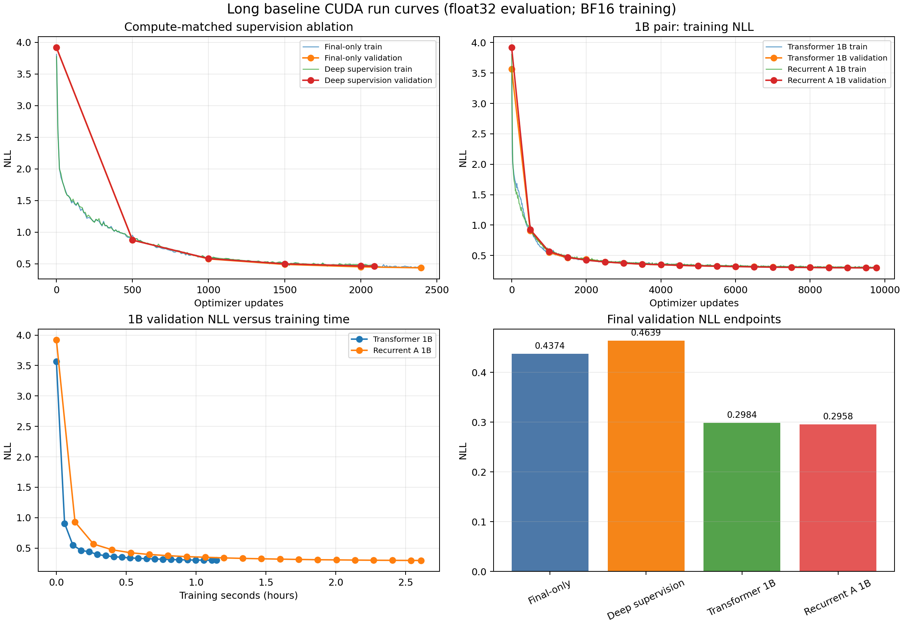
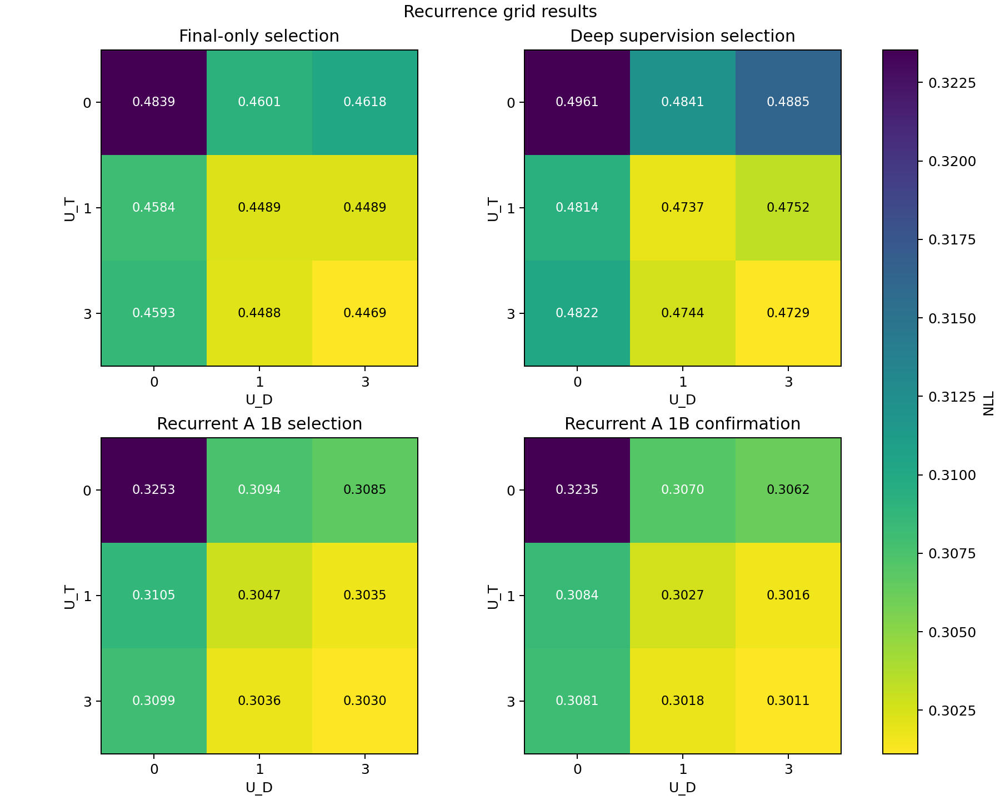

# Long CUDA baseline results

Date: 2026-09-18  
Branch: `mvp-2d-recurrence`  
Source commit: `05704ec0a6ac7c8d064c9c430bea9f425c0c4fb3`

## Outcome

The compute-matched supervision choice is final-only. Final-only had lower NLL than deep supervision in all nine grid cells at nearly identical measured training time. The measured deep/final update-time ratio was 1.131, and peak allocated memory increased from 3.05 GiB to 3.37 GiB.

The unchanged 1B pair then showed a small but consistent benefit from the recurrent execution graph. At the deepest `(3,3)` evaluation cell, recurrent A beat the ordinary transformer baseline by 0.003106 NLL on the selection panel and 0.004185 on the disjoint confirmation panel. This is evidence that the trained recurrent model is useful in this pilot, but it is one training seed per model; the placement standard deviations below are not training-seed uncertainty.

No 64B run was launched.

## Provenance and protocol

- CUDA 13.0, PyTorch 2.14.0, Python 3.11.16, one RTX A6000, frozen `uv` environment.
- Training used BF16 as pinned by the serious-experiment profile. Evaluation used CUDA float32.
- Dataset: revision `1a932e1abca935aae585f417ede39ecde4f2a620`, manifest hash `5bddf4ef8f534dd18bb52965dee373e51d653c629c0cc3f74ce9b34a7fbf38ac`.
- Selection panel: 256 rows, panel hash `645b9ce2269bf14e1997101013429597a0eb779d853e65752b71c9c362b4cb70`.
- Confirmation panel: a disjoint 512-row sample drawn outside the selection panel.
- Mask-placement seeds: 11, 23, and 37. The evaluator labels these as population variation across placements, not variation across training seeds.
- The model, optimizer, recurrence distribution, objective, and learning-rate schedule were kept fixed. The recurrent 1B member used the locked final-only supervision choice.

The full provenance receipts are in [`environment.json`](../experiments/ablations/supervision_compute/results/environment.json), [`protocol.json`](../experiments/ablations/supervision_compute/results/protocol.json), [`panel.json`](../experiments/ablations/supervision_compute/results/panel.json), and [`decision.json`](../experiments/ablations/supervision_compute/results/decision.json).

## Supervision selection

The benchmark used fresh CUDA timing samples, not the old MPS measurements:

| Mode | Mean update seconds | Median update seconds | Peak allocated | Characters/second | Projected 1B / 64B training time |
|---|---:|---:|---:|---:|---:|
| Final-only | 0.8950 | 0.8782 | 3.05 GiB | 114,300 | 2.43 h / 155.5 h |
| Deep supervision | 1.0120 | 0.9949 | 3.37 GiB | 101,082 | 2.75 h / 175.9 h |
| Transformer baseline | 0.4010 | 0.4003 | 1.20 GiB | 255,142 | 1.09 h / 69.7 h |
| Deep-more diagnostic | 1.1976 | 1.1847 | 3.36 GiB | 85,419 | 3.25 h / 208.1 h |

The two ablations were then trained for the frozen equal-time budget:

| Mode | Training seconds | Optimizer updates | Characters | Selection NLL at `(3,3)` |
|---|---:|---:|---:|---:|
| Final-only | 2,188.406 | 2,397 | 245,213,100 | 0.446943 |
| Deep supervision | 2,187.651 | 2,089 | 213,704,700 | 0.472899 |

Final-only won the predeclared selection comparison. The recorded reason and report hashes are in [`decision.json`](../experiments/ablations/supervision_compute/results/decision.json).

### Selection-panel NLL grids

Rows are `U_T = 0, 1, 3`; columns are `U_D = 0, 1, 3`. These are execution-graph settings evaluated from each checkpoint, not separate training seeds.

Final-only:

| `U_T \\ U_D` | 0 | 1 | 3 |
|---:|---:|---:|---:|
| 0 | 0.483885 | 0.460101 | 0.461769 |
| 1 | 0.458443 | 0.448868 | 0.448927 |
| 3 | 0.459289 | 0.448808 | **0.446943** |

Deep supervision:

| `U_T \\ U_D` | 0 | 1 | 3 |
|---:|---:|---:|---:|
| 0 | 0.496079 | 0.484131 | 0.488504 |
| 1 | 0.481404 | 0.473683 | 0.475157 |
| 3 | 0.482249 | 0.474441 | **0.472899** |

The final-only and deep selection reports are [`evaluation-selection.json`](../experiments/ablations/supervision_compute/results/final/evaluation-selection.json) and [`evaluation-selection.json`](../experiments/ablations/supervision_compute/results/deep/evaluation-selection.json), respectively. The selected final-only confirmation report is [`evaluation-confirmation.json`](../experiments/ablations/supervision_compute/results/final/evaluation-confirmation.json).

## 1B pair

Both models reached exactly 9,776 optimizer updates, or 1,000,084,800 character predictions. The recorded cumulative training seconds are not wall time: the pair was interrupted once by spot preemption and resumed from a durable checkpoint. The first pair queue ran from 17:17:42 UTC; the resumed queue completed at 21:18:45 UTC, a 4 h 01 m 03 s wall-clock window including interruption and provisioning time.

| Model | Training seconds | Optimizer updates | Characters | Selection NLL / accuracy | Confirmation NLL / accuracy |
|---|---:|---:|---:|---:|---:|
| Transformer baseline | 4,126.994 | 9,776 | 1,000,084,800 | 0.306095 / 0.884523 | 0.305294 / 0.884367 |
| Recurrent A, final-only objective `(3,3)` | 9,412.510 | 9,776 | 1,000,084,800 | 0.302989 / 0.885707 | 0.301109 / 0.886144 |

For clarity, the recurrent selection grid's key cells are:

| Setting | NLL | Accuracy |
|---|---:|---:|
| `(0,0)` ordinary execution | 0.325313 | 0.877883 |
| `(1,0)` temporal-only | 0.310501 | 0.882759 |
| `(0,3)` depth-only | 0.308493 | 0.884084 |
| `(3,3)` combined refinement | 0.302989 | 0.885707 |

The confirmation grid gives the same ordering: `(0,0)` 0.323541, `(1,0)` 0.308446, `(0,3)` 0.306195, and `(3,3)` 0.301109. The complete selection and confirmation reports are in the [`transformer_1B/results`](../experiments/long_runs/transformer_1B/results/) and [`recurrent_a_1B/results`](../experiments/long_runs/recurrent_a_1B/results/) directories.

## Interpretation and diagnostics

- The ablation decides the supervision objective, not whether recurrence is useful. Final-only is cheaper and performed better at matched time, so the recurrent 1B continuation used final-only loss.
- In the longer recurrent pilot, temporal-only execution improves over `(0,0)`, depth-only also improves, and `(3,3)` is best. This is a training-graph execution comparison from one recurrent checkpoint; it is not a new architecture or a new training sweep.
- The recurrent `(3,3)` selection cell has prediction-change rate 0.047780 and the confirmation cell 0.047600. This confirms that the live-feedback path changes predictions, but diagnostic gradient or prediction changes alone are not proof of useful recurrence; the matched baseline comparison supplies the useful-evidence test here.
- Placement variation is limited to the three declared mask seeds. Nonzero placement standard deviations occur in cells with multiple possible write placements; they must not be reported as seed error bars.
- The evaluation reports mark the recurrent measurements as `execution: training_graph`. They do not claim that a generated training graph is equivalent to live external feedback beyond the model semantics defined in the recurrence contract.

## Interruptions and resumability

The first spot VM was preempted during the deep-supervision ablation; deep resumed from a durable checkpoint and completed. A later spot VM was preempted during recurrent 1B training; rerunning the exact pair command verified the completed transformer and resumed recurrent from its durable checkpoint. No completed checkpoint was overwritten. The durable run logs are in [`remote_logs`](../experiments/ablations/supervision_compute/results/remote_logs/).

## Raw artifacts

- [`supervision_compute/results`](../experiments/ablations/supervision_compute/results/)
- [`transformer_1B/results`](../experiments/long_runs/transformer_1B/results/)
- [`recurrent_a_1B/results`](../experiments/long_runs/recurrent_a_1B/results/)
- [`LONG_BASELINE_CURVES.png`](LONG_BASELINE_CURVES.png)
- [`LONG_BASELINE_GRID.png`](LONG_BASELINE_GRID.png)

The raw checkpoints, intermediate checkpoints, metrics, event logs, plans, environment/protocol/panel/decision receipts, evaluation reports, and remote queue logs are retained in those directories.
